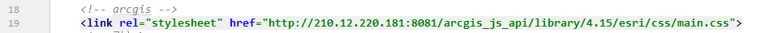
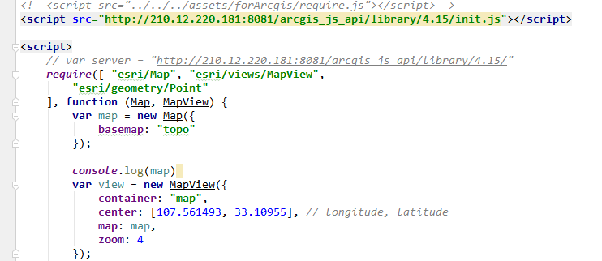

# 学习 arcgis
## 介绍：
### 官网：
[arcgis](https://developers.arcgis.com/javascript/)
[博客园1](https://www.cnblogs.com/onsummer/p/9080187.html)

[b站视频1](https://www.bilibili.com/video/BV1Nx411Y7Er)

### Arcgis Server:
地图数据 - 数据库 GeoJson   
地图影像 -  tif, tnf...   
地图服务 - 发布不同服务   

### Arcgis API:
前端使用数据的API:  

## 学习方法：
a. 看官网，看案例，看文档，   
实在不知道怎么配置看看源码里面怎么定义的   
b. 看别人的博客，教程   
c. 看视频  

## 学习简单的基础：
1. 4.x 和 3.x 两套不同，  
2. 4.x 的 将数据和视图分开来了，还用了ts等 .........................  
3. require 
    - 模块化语法
    - dojoConfig 引入本地的js, 需要放在 arcgis 源文件引入的上面定义
4. graphic
    - 画点、线、面, 通过 geometry.type
    - 通过配置 symbol.type 设置不同的图案来源
5. map 
    - 加载底图  
    - 配合 mapview     
6. featurelayer
    - 可以画一群点、线、面，设置弹窗，通过 featurereduction 可以设置 cluster (点聚合模式)   
    - 其中 fieldInfo 的 ObjectId 隐射 graphic.attributes.ObjectId, ObjectId 必不可少，
    弹窗获取只能获取到 ObjectId 

### 介绍 API：

### 实践功能：
#### 需求：
1. 完成设备点，点击可以弹窗显示数据或者视频播放
2. 画区域边界
3. 可以实现点聚合

#### 遇到的问题：
1. 视频播放问题： featurelayer 的弹窗中只有用原生js（不是字符串）的时候，图片、视频等的 src、id 等属性才能指定上，使用不同插件之后，需要在页面根部隐藏设置好一个在播放的，然后返回添加到弹窗中
2. 底图问题：  
    - 可以使用 Google地图、高德地图、百度地图等等的，它自己也自带底图，设置 map 即可
    - 其他可以百度搜一搜（arcgis js 高德地图）

3. 点聚合设置 labelingInfo 无效： 
    - 4.16之后直接添加了一个smartMapping/cluster的类， 部署版本为 4.15 
    - 4.15 的 featurelayer 将 labelingInfo 设置在该 layer 第一级即可
