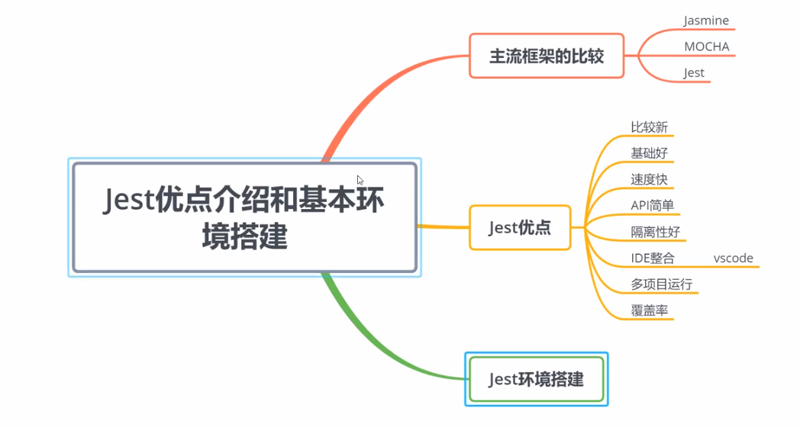

# Jest 自动化测试框架

## 认识


## 安装
- 新建目录 JestTesT
- node 安装(npm), 
  ```npm -D install jest@24.8.0```
- xxx.js 对应测试文件为 xxx.test.js
- package.json 文件中:
    ```
    "scripts": {
        "test": "jest",
    },
    ```
- 单元测试 unit testing : 针对一个模块进行测试案例的编写     
  集成测试 ： 多个模块组成一个功能或者系统进行测试案例的编写    

## jest 基本配置 和 测试覆盖率
1) npx jest --init
   选择 browser-like\y\y
   生成 jest.config.js
2) npx jest --coverage 生成代码覆盖率报告(xx/coverage/lcov-report/index/html)     
   可以在 package.json 中配置命令：
   ```
   "scripts": {
       "coverage": "jest --coverage"
   },
   ```
3) 语法 看 [官网](https://www.jestjs.cn/docs/using-matchers)   
- matchers (匹配器)   
    toBe   
    toEqual    
    not.toBe   
    ...   
    toBeCloseTo 解决浮点数问题, 计算机精度问题 