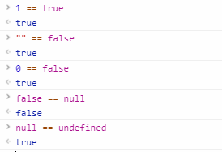
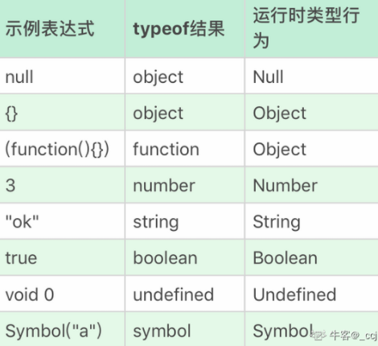
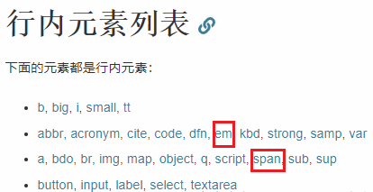
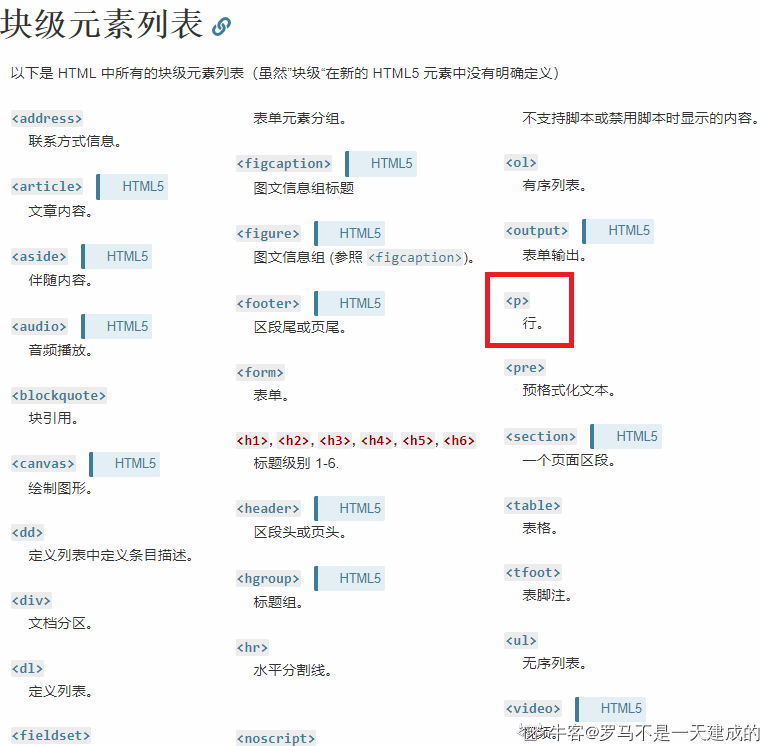
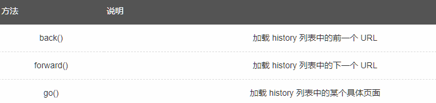
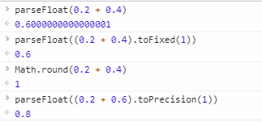

<!-- 错题生题记录 -->
# 简单回顾旅程

## 日记表格

## 记录
| 序号 | 时间 | 题目数量 | 知识点 | 通过率 | 题目内容 | 备注 | 
| ---- | ---- | --- | --- | --- | --- | --- |
| 1 | 2021.2.24 | 10 | js | 0.8 | js基础 |  |
| 2 | 2021.2.25 | 10 | js | 0.8 | js、css 基础 |  |
| 3 | 2021.3.1 | 10 | js | 0.7 | js、jquery 基础 |  |
| 4 | 2021.3.2 | 10 | js | 0.7 | js、angular数据绑定基础 |  |
| 5 | 2021.3.3 | 10 | js | 0.7 | js | 由于3.3号忘记了，4号补上 |
| 6 | 2021.3.4 | 10 | js | x  | js | x | 
| 7 | 2021.3.8 | 10 | js | 0.8 | js | js基础 |

## 内容

### 2021.2.24 
1. for ... in    
for-in 语句，用来枚举对象的属性。
for-in 语句能够枚举对象的自定义属性和原型链属性，而 hasOwnProperty 只能获取自定义的属性
for i in arr 在数组中 i 为 索引  

2. == 号, null 与 undefined
    
需要注意的是 null 与 undefined 在与其他数相等运算时不进行类型转换       
undefined 和 null 与任何有意义的值比较返回的都是false，但是 null 与 undefined 之间互相比较返回的是 true。

3. 浅拷贝函数 slice    
Slice 方法能对数组进行浅拷贝，不能实现深拷贝。    
splice, sort, push, pop 等会改变原数组。 

4. Math.round 函数  
Math.round(num) num 小数大于或等于5的话 朝大的方向 进一(负数的话朝 0 为大数)

    其他补充：

    floor  下取整   
    ceil   上取整   
    random   生成随机数 0 - 1    
    abs(x)  返回 x 的绝对（正）值        

5. promise 与 setTimeout 的执行顺序   
总体上说：   
先执行同步的任务  
->  
执行异步任务 (其中异步任务分为宏任务和微任务，微任务优先级高于宏任务。promise.then 执行的微任务,setTimeout 执行的是宏任务)    
Promise定义之后便会立即执行, promise.then() 是 微任务，会在当前轮事件循环结束前执行；
setTimeout 是 宏任务，在下一轮事件循环执行   

    *随便找了个博客讲解：
    https://www.cnblogs.com/sunmarvell/p/9564815.html* 

6. 静态语言与动态语言的理解   
静态语言（强类型语言）   
静态语言是在编译时变量的数据类型即可确定的语言，多数静态类型语言要求在使用变量之前必须声明数据类型。 
例如：C++、Java、Delphi、C#等。    
动态语言（弱类型语言）        
动态语言是在运行时确定数据类型的语言。变量使用之前不需要类型声明，通常变量的类型是被赋值的那个值的类型。 
例如PHP/ASP/Ruby/Python/Perl/ABAP/SQL/JavaScript/Unix Shell等等。

7. javascript异步模式的编程    
“同步模式”和“异步模式”：    
（1）同步模式：就是后一个任务等待前一个任务结束，然后再执行，程序的执行顺序与任务的排列顺序是一致的、同步的。      
（2）异步模式：完全不同，每一个任务有一个或多个回调函数（callback），前一个任务结束后，不是执行后一个任务，而是执行回调函数，后一个任务则是不等前一个任务结束就执行，所以程序的执行顺序与任务的排列顺序是不一致的、异步的。       
JavaScript中实现异步编程模式的4种方法,回调函数、事件监听、发布/订阅、Promises对象：      
（1）回调函数：这是异步编程最基本的方法，优点是简单、容易理解和部署，缺点是不利于代码的阅读和维护，各个部分之间高度耦合（Coupling），流程会很混乱，而且每个任务只能指定一个回调函数。    
例：假定有两个函数f1和f2，后者等待前者的执行结果，如果f1是一个很耗时的任务，可以考虑改写f1，把f2写成f1的回调函数。   
（2）事件监听：任务的执行不取决于代码的顺序，而取决于某个事件是否发生。优点是比较容易理解，可以绑定多个事件，每个事件可以指定多个回调函数，而且可以”去耦合”（Decoupling），有利于实现模块化。缺点是整个程序都要变成事件驱动型，运行流程会变得很不清晰。    
例：为f1绑定一个事件，当f1发生done事件，就执行f2。   
（3）发布/订阅：我们假定，存在一个”信号中心”，某个任务执行完成，就向信号中心”发布”（publish）一个信号，其他任务可以向信号中心”订阅”（subscribe）这个信号，从而知道什么时候自己可以开始执行。这就叫做”发布/订阅模式”（publish-subscribe pattern），又称”观察者模式”（observer pattern）。    
这种方法的性质与”事件监听”类似，但是明显优于后者。因为我们可以通过查看”消息中心”，了解存在多少信号、每个信号有多少订阅者，从而监控程序的运行。    
（4）Promises对象：是CommonJS工作组提出的一种规范，目的是为异步编程提供统一接口。简单说，它的思想是，每一个异步任务返回一个Promise对象，该对象有一个then方法，允许指定回调函数。回调函数变成了链式写法，程序的流程可以看得很清楚，而且有一整套的配套方法，可以实现许多强大的功能。    
例：f1的回调函数f2，f1().then(f2);   

8. 表达式的值为0 ？
 - (()=>{}).length    
 (()=>{}).length; 获取方法形参个数，形参为0
 - 1 & 2       
 1=0001 2=0010  按位与运算，同为1才为1，否则返回0
 - +[]     
 +[] 隐式类型转换，因为[]是对象，所以toPrimitive->valueOf->toString为''，结果就是+''===0
 - [1,2,-3].reduce((a, b) => a - b, 0)        
  reduce对数组中的每个元素执行一个reducer函数(升序执行)，将其结果汇总为单个返回值。a为累计器累计回调的返回值，b为数组的每一项元素，传入初始值0->0-(1)->(-1)-2->(-3)-(-3)->0    

### 2021.2.25
1. 字符串相加 、'+'、'-'
    - console.log(1+ "2"+"2");   
    做加法时要注意双引号，当使用双引号时，JavaScript认为是字符串，字符串相加等于字符串合并。
    因此，这里相当于字符串的合并，即为122.
    - console.log(1+ +"2"+"2");   
    第一个+"2"中的加号是一元加操作符，+"2"会变成数值2，因此1+ +"2"相当于1+2=3.
    然后和后面的字符串“2”相合并，变成了字符串"32".
    - console.log("A"- "B"+"2");    
    "A"-"B"的运算中，需要先把"A"和"B"用Number函数转换为数值，其结果为NaN，在剪发操作中，如果有一个是NaN，则结果是NaN，因此"A"-"B"结果为NaN。
    然后和"2"进行字符串合并，变成了NaN2.
    - console.log("A"- "B"+2);    
    根据上题所述，"A"-"B"结果为NaN，然后和数值2进行加法操作，在加法操作中，如果有一个操作数是NaN，则结果为NaN。

2. instanceof、=== 、==
    - instanceof 运算符希望左操作数是一个对象，右操作数表示对象的类（初始化对象的构造函数）。如果左侧的对象是右侧对象的实例，返回true，否则返回false。
    例如：计算 o instanceof f  
    首先计算f.prototype，然后在原型链中查找o，找到返回true

    - === 严格相等运算符：首先计算其操作数的值，然后比较这两个值，比较过程中没有任何类型转换

    - == 相等运算符：如果两个操作数不是同一类型，那么会尝试进行一些类型转换，然后进行比较   
    1)尽管null和undefined是不同的，但它们都表示“值的空缺”，两者往往可以互换，因此==运算符认为两者是相等的   
    2)NaN表示非数字值，特殊之处：它和任何值都不相等，包括自身。判断NaN的方法：x!=x返回true

3. xx is not defined 报错   
    本 scope(作用域) 内找不到 xx, 就会报错

4. Ajax 的 XMLHttpRequest 对象   
    Ajax不是新的编程语言，而是一门提供网页局部刷新的技术。    
    Ajax最大的优点是在不重新加载整个页面的情况下，与服务器交换数据并更新部分网页内容。    
    Ajax技术核心就是 XMLHttpRequest 对象。    
    Ajax技术的工作原理：*分为3步*    
    1）创建Ajax对象：```var xhr = new XMLHttpRequest()```;
    2）xhr 发送请求：```xhr.open('get','test.html','true');xhr.send();```    

    3）xhr获取响应：
    ```
    xhr.onreadystatechange = function(){
        if(xhr.readystate == 4){//请求的状态码
            /*
            0：请求还没有建立（open执行前）
            1：请求建立了还没发送（执行了open）
            2：请求正式发送（执行了send）
            3：请求已受理，有部分数据可以用，但还没有处理完成
            4：请求完全处理完成
            */
            alert(xhr.responseText);//返回的数据
        }
    }
    ```

    get 的 ajax 请求的代码：
    ```
    function loadXMLDoc()
    {
        var xmlhttp;
        if (window.XMLHttpRequest){
            // code for IE7+, Firefox, Chrome, Opera, Safari
            xmlhttp = new XMLHttpRequest();
        } else { // code for IE6, IE5
            xmlhttp = new ActiveXObject("Microsoft.XMLHTTP");
        }
        xmlhttp.onreadystatechange = function(){
            if (xmlhttp.readyState == 4 && xmlhttp.status == 200){
                document.getElementById("myDiv").innerHTML = xmlhttp.responseText;
            }
        }
        xmlhttp.open("GET", "/ajax/demo_get.asp",true);
        xmlhttp.send();
    }```

5. enum 是 ts 中的语法    
   es6 中 [generator](https://es6.ruanyifeng.com/#docs/generator)   
   Generator 函数是ES6的一种异步编程解决方案    
 
6. 函数和变量声明提前，然后赋值    
    ```
    var x = foo();
    var foo=function foo() {...}
    ```
    语句中变量的声明会提升，但是定义不会提升。以上代码等同于：

    ```
    var x;
    var foo;
    x = foo();
    foo = function foo() {...}
    ```
    当执行到 x = foo() 时，由于foo未被定义为函数，所以会返回

    ```TypeError: foo is not a function```


### 2021.2.26
1. ECMAScript 中有 5 中简单数据类型（也称为基本数据类型）： Undefined、Null、Boolean、Number 和 string。还有一种复杂数据类型——Object。（摘自高级程序设计）

2. this 指向问题：   
JS中this关键字， 它代表函数 <strong>运行</strong> 时，自动生成的一个内部对象，只能在函数内部使用。   
this有四种情况:    
1) 当在函数调用的时候指向widow   
2) 当方法调用的时候指向调用对象    
3) 当用apply和call上下文调用的时候指向传入的第一个参数    
4) 构造函数调用指向实例对象    

3. innerHTML 和 innerText 的区别
https://blog.csdn.net/shueiyuan1983/article/details/52960950

4. call、apply、bind   
菜鸟教程的解释：https://www.runoob.com/w3cnote/js-call-apply-bind.html     
call 、bind 、 apply 这三个函数的第一个参数都是 this 的指向对象，第二个参数差别就来了：    
call 的参数是直接放进去的，第二第三第 n 个参数全都用逗号分隔     
apply 的所有参数都必须放在一个数组里面传进去      
bind 除了返回是函数以外，它 的参数和 call 一样。    

5. react 的 jsx 模板    
在jsx中直接写行内样式时不能采用引号，而是style={{color:'red'}}的方式。    

6. typeof   
    


### 2021.3.1
1. jquery 匹配包含文本的元素  - contains()
    - text() 设置或获取被选元素的文本内容   
    - contains 选择器，检测元素是否包含指定字符串的元素     
    - input() 选择器，选取表单元素    
    - attr(name, value) 属性操作，设置或获取被选元素的属性和属性值   

2. javascript中实现跨域的方式总结   
    1) jsonp 请求；jsonp的原理是利用 ```<script>``` 标签的跨域特性，可以不受限制地从其他域中加载资源，类似的标签还有 ``````.
    2) document.domain；这种方式用在主域名相同子域名不同的跨域访问中
    3) window.name；window 的 name 属性有个特征：在一个窗口 (window) 的生命周期内, 窗口载入的所有的页面都是共享一个 window.name 的，每个页面对window.name 都有读写的权限，window.name 是持久存在一个窗口载入过的所有页面中的，并不会因新页面的载入而进行重置。
    4) window.postMessage；window.postMessages 是 html5 中实现跨域访问的一种新方式，可以使用它来向其它的 window 对象发送消息，无论这个 window 对象是属于同源或不同源。
    5) CORS；CORS 背后的基本思想，就是使用自定义的 HTTP 头部让浏览器与服务器进行沟通，从而决定请求或响应是应该成功还是应该失败。
    6) Web Sockets；web sockets 原理：在 JS 创建了 web socket 之后，会有一个 HTTP 请求发送到浏览器以发起连接。取得服务器响应后，建立的连接会使用HTTP 升级从 HTTP 协议交换为 web socket 协议。

### 2021.3.2
1. angular 绑定数据
    - 直接使用 {{value}} 绑定变量，会因为加载先后顺序，出现闪屏的现象，官方建议使用 ng-bind
    - ng-model 属于双向绑定 用于 Input 的输入值和变量绑定起来，不能绑定在 div 等标签上
    - ng-bind="value" 直接把变量绑定在标签上，当超过一定数量时，会出现性能问题
    - ng-bind="obj.value"，官方建议把对象的属性绑定在视图上，其次才是对象本身

2. 表单元素设置不可用状态
    - Readonly 只针对 input(text/password) 和 textarea 有效      
    - disabled 对于所有的表单元素有效，包括 select, radio, checkbox, button 等。

3. 数组方法
    - 会改变数组的方法：
    ```javascript
        push()
        pop()
        shift()
        unshift()
        splice()
        sort()
        reverse()
        forEach()
    ```
    - 不会改变数组的方法：
    ```javascript
        filter()
        concat() 
        slice()
        map()
    ```


### 2021.3.3 
1. 鼠标触发事件
[w3cschool](https://www.w3cschool.cn/xqw2e7/67yk19wx.html)
onContextMenu: 当浏览者按下鼠标右键出现菜单时或者通过键盘的按键触发页面菜单时触发的事件 [试试在页面中的<body>中加入onContentMenu="return false"就可禁止使用鼠标右键了]
- 常见的事件：
    1. 点击事件：
        1. onclick：单击事件
        2. ondblclick：双击事件
    2. 焦点事件
        1. onblur：失去焦点
        2. onfocus:元素获得焦点。
    3. 加载事件：
        1. onload：一张页面或一幅图像完成加载。
    4. 鼠标事件：
        1. onmousedown    鼠标按钮被按下。
        2. onmouseup    鼠标按键被松开。
        3. onmousemove    鼠标被移动。
        4. onmouseover    鼠标移到某元素之上。
        5. onmouseout    鼠标从某元素移开。
    5. 键盘事件：
        1. onkeydown    某个键盘按键被按下。    
        2. onkeyup        某个键盘按键被松开。
        3. onkeypress    某个键盘按键被按下并松开。
    6. 选择和改变
        1. onchange    域的内容被改变。
        2. onselect    文本被选中。
    7. 表单事件：
        1. onsubmit    确认按钮被点击。
        2. onreset    重置按钮被点击。

2. 白屏时间(first paint) 和 可交互时间(dom ready)
白屏时间（first Paint Time）——用户从打开页面开始到页面开始有东西呈现为止
首屏时间——用户浏览器首屏内所有内容都呈现出来所花费的时间
用户可操作时间(dom Interactive)——用户可以进行正常的点击、输入等操作，默认可以统计domready时间，因为通常会在这时候绑定事件操作
总下载时间——页面所有资源都加载完成并呈现出来所花的时间，即页面 onload 的时间
    **firstPaint：白屏时间，也就是开始解析DOM耗时，用户在没有滚动时候看到的内容渲染完成并且可以交互的时间。
    domReadyTime：用户可操作时间。**

3. js 中 数字在计算机中内存储： 8 Byte
    1. Javascript中，由于其变量内容不同，变量被分为基本数据类型变量和引用数据类型变量。基本类型变量用八字节内存，存储基本数据类型(数值、布尔值、null和未定义)的值，引用类型变量则只保存对对象、数组和函数等引用类型的值的引用(即内存地址)。
    JavaScript内部，所有数字都是以 64 位浮点数形式储存，即使整数也是如此。
    64 bit = 8 Byte
    2. JS中的数字是不分类型的，也就是没有byte/int/float/double等的差异。


4. 块级元素与行内元素
块级元素与行内元素有几个关键区别：
格式默认情况下，块级元素会新起一行。内容模型一般块级元素可以包含行内元素和其他块级元素。这种结构上的包含继承区别可以使块级元素创建比行内元素更”大型“的结构。



### 2021.3.4 
1. '+'、'-'算法的不同
```javascript
/**
 * a. 加法有字符串会自动转为 String 类型
 * b. 减法会转为 Number 类型
 * /
var foo = "10" + 3 - "1";  // = "103" - "1"
console.log(foo); // number 类型的 102
```
2. common.js 用到的四个变量
浏览器不兼容CommonJS的根本原因，在于缺少四个Node.js环境的变量。```module exports require global```
—— 来自阮一峰http://www.ruanyifeng.com/blog/2015/05/commonjs-in-browser.html 

3. History 对象
History 对象包含用户（在浏览器窗口中）访问过的 URL。
History 对象是 window 对象的一部分，可通过 window.history 属性对其进行访问。
注意： 没有应用于 History 对象的公开标准，不过所有浏览器都支持该对象。



4. Number 类型转为 String 类型 - toString
```javascript
/**
 * 数字后面.会被解析为小数点
 * 2.toString() 将会优先将小数点解析为数字小数点
 * 2..toString() 因为连续的两个小数点不符合 number 的格式规则，第二个小数点才会被解析为调用方法
 */
2.toString()
// VM3872:1 Uncaught SyntaxError: Invalid or unexpected token
2..toString()
// "2"
2 .toString()
// "2"
(2).toString()
// "2"
```

### 2021.3.8
1. js 改变作用域的方法 : try catch, with, eval
while 的话只是在函数局部环境或者全局环境运行，并不会改变作用域链。 
js 有两种作用域：全局和局部
在最外层定义的变量拥有全局作用域，对任何内部函数来说，都是可以访问的；而局部作用域则只有内部函数定义的变量才拥有；在函数内部定义变量时，要使用 var ，否则定义的变量时全局变量
js 是没有块级作用域的，因此 for 循环中的i在执行完循环后，还可以被同作用域的代码获取。js 的作用域都是相对于函数而言，是函数作用域。
js 的作用域链：
每个函数执行都会生成一个执行环境，全局执行环境是最外围的执行环境且被认为是 window 对象，因此所有全局变量和函数都会作为 window 对象的属性和方法而被创建；当一个函数被调用时，该函数环境的变量对象就会被压入一个环境栈中。而在函数执行之后，栈将该函数的变量对象弹出，把控制权交给之前的执行环境变量对象
js 如何来延长作用域链：
有三种语句可以加强作用域链：try catch；with；eval
try catch 中的 catch 和 with 语句都会在作用域链的前端添加一个变量对象。对 with 语句来说，将指定的对象添加到作用域链中，对 catch 语句来说，会创建一个新的变量对象，其中包含的是被抛出的错误对象的声明，而eval由于可以被赋值给变量，在被赋值的时候会将 eval 所处的变量作用域也赋值过去，所以可以使得作用域获得扩展。
    ```javascript
    var x=1,evalg=eval;
    function a(){
    　　var x=3;
    　　eval("alert(x)");//3
    　　evalg("alert(x)");//1
    }
    ```

2. 一些函数的使用
    - [for in](https://developer.mozilla.org/zh-CN/docs/Web/JavaScript/Reference/Statements/for...in)   
        以任意顺序遍历一个对象的除Symbol以外的可枚举属性。   
        是为遍历对象属性而构建的，    
    - [object.defineProperty](https://developer.mozilla.org/zh-CN/docs/Web/JavaScript/Reference/Global_Objects/Object/defineProperty)    
        该方法会直接在一个对象上定义一个新属性，或者修改一个对象的现有属性，并返回此对象。  
        *vue 就是使用这一属性来实现数据的双向绑定的。*   
    - prototype 属性 : 使您有能力向对象添加属性和方法
        [百度百科](https://baike.baidu.com/item/prototype/14335187?fr=aladdin)
    - hasOwnProperty : 判断对象是否包含特定的自身（非继承）属性。
        [任意搜的](https://www.cnblogs.com/weiqinl/p/8683207.html)
    - [原型链](https://blog.csdn.net/xiaoermingn/article/details/80745117)

### 2021.3.9
1. js 中 number 存在精度问题
```javascript
/**
parseFloat() 函数可解析一个字符串，并返回一个浮点数。

该函数指定字符串中的首个字符是否是数字。如果是，则对字符串进行解析，直到到达数字的末端为止，然后以数字返回该数字，而不是作为字符串。
*/
parseFloat(0.2 + 0.4) // 0.6000000000000001
/**
toFixed() 方法可把 Number 四舍五入为指定小数位数的数字
num 必需。规定小数的位数，是 0 ~ 20 之间的值，包括 0 和 20，有些实现可以支持更大的数值范围。如果省略了该参数，将用 0 代替。
*/
parseFloat((0.2 + 0.4).toFixed(1)) // 0.6  
Math.round(0.2 + 0.4) // 1
/**
toPrecision() 方法可在对象的值超出指定位数时将其转换为指数计数法。
*/
parseFloat((0.2 + 0.6).toPrecision(1)) // 0.8
```


2. RegExp对象  
JavaScript RegExp 对象有 3 个方法：test()、exec() 和 compile()。
(1) test() 方法用来检测一个字符串是否匹配某个正则表达式，如果匹配成功，返回 true ，否则返回 false；
(2) exec() 方法用来检索字符串中与正则表达式匹配的值。exec() 方法返回一个数组，其中存放匹配的结果。如果未找到匹配的值，则返回 null；
(3) compile() 方法可以在脚本执行过程中编译正则表达式，也可以改变已有表达式。

*match 是支持正则表达式的 String 对象的方法*

3. es6 语法
    - [Symbol](https://es6.ruanyifeng.com/#docs/symbol)
    - [Object.assign](https://www.jianshu.com/p/f9ec860ecd81)
    - [Generator](https://es6.ruanyifeng.com/#docs/generator)

