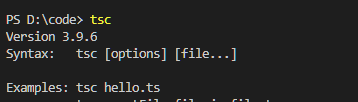
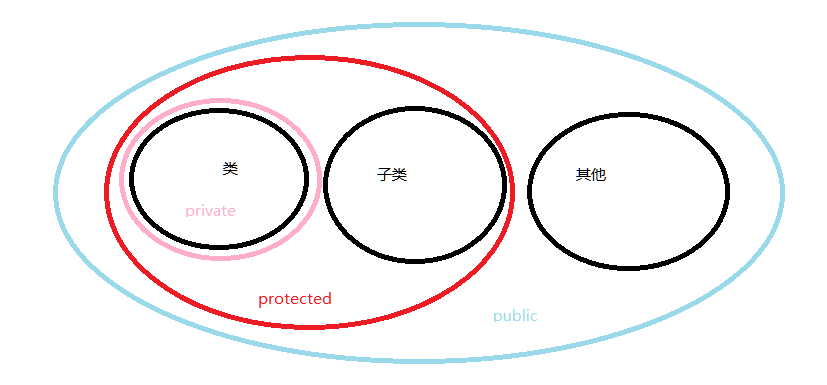
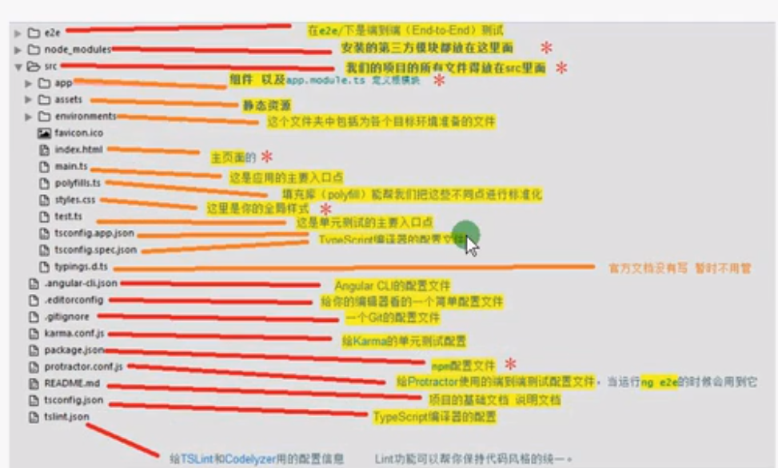
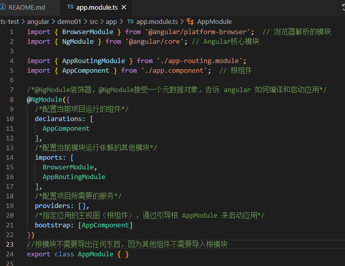
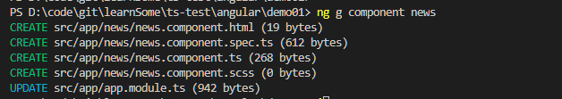
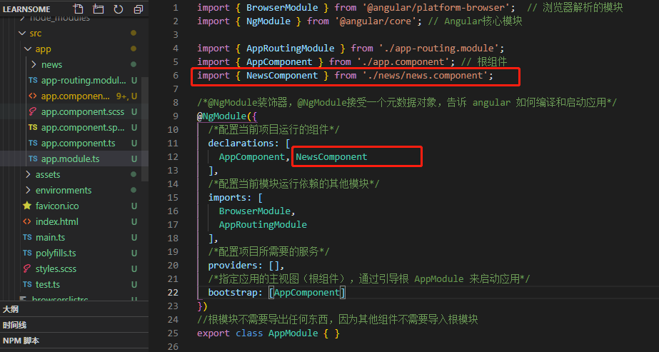
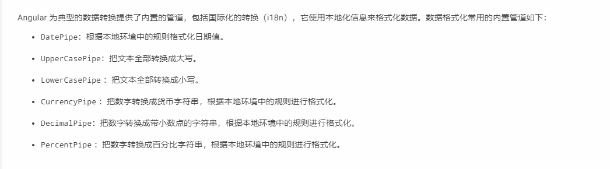

## 前提：

### 1. 视频链接：
[主讲老师大地](https://www.bilibili.com/video/BV1yt411e7xV?from=search&seid=13056183740590042272)

### 2. 文件链接： 
[itying-typescript教程](https://www.itying.com/goods-905.html)


### 3. 官网：
[typescript](https://ts.xcatliu.com/introduction/hello-typescript.html)   
[ts](https://www.typescriptlang.org/)  
[angular](https://angular.cn/start)

### 学习日记
| 序号 | 时间 | 阶段 | 视频集数 | 内容 | 备注 | 
| ---- | ---- | ---- | ------- | ---- | --- |
| 1 | 2021.1.6 | 初步详细输入阶段 | 01 - 07 | 从初步认识，搭建编译环境，数据类型，函数，类 | 较为详细的接触 |
| 2 | 2021.1.7 | 初步详细输入阶段 | 08 - 18 | 接口，泛型，泛型类，泛型接口，模块化，命名空间 | 主要意识到了面向对象的思想, 其中 视频17的案例需要补充 |
| 3 | 2021.1.8上午 | 初步详细输入阶段 | 19 - 20 | 装饰器 | 补充视频17的案例，学习装饰器，下午有其他事情 |
| 4 | 2021.1.21 | 初步认识阶段 | 21 - 23 | ts + angular | 学习angular的安装、目录、语法的组件和绑定数据语法 | 
| 5 | 2021.1.22 - 23 | 初步认识 | 23 - end/ 24 | angular | 学习 angular 的一些语法, 视频刷了一遍 | 
| 6 | 2021.1.25下午 | 初步认识 | 24 - 27 | 一些语法，vue是参照angular来的，有些相似，有点懈怠，听不下去了 |
## 一、简介  
google研发，为了面向大型复杂的项目，使用javascript可以搭建   
ts 是 javascript 的超集，包含 es6 和 es5   
实现类似 java | c# 这种面向对象的编程语言   
 
ts 是由 c# 之父 [Anders Hejlsberg](https://baike.baidu.com/item/%E5%AE%89%E5%BE%B7%E6%96%AF%C2%B7%E6%B5%B7%E5%B0%94%E6%96%AF%E4%BC%AF%E6%A0%BC/2152925?fromtitle=Anders%20Hejlsberg&fromid=9081506&fr=aladdin) 发起的

*建议使用 es6 语法*

## 二、使用

### 1. 安装  
``` npm|cnpm install -g typescript``` 或者  
```yarn global add typescript ```

安装成功如下图：


### 2. 使用
- 创建文件 hello.ts   
写入ts语法

- ts 编译成 es5 语法  
浏览器本身不支持ts语法   
命令： ``` tsc hello.ts ```
*注意：每次运行都需要编译*

- 配置自动化编译脚本  
    1. 创建 tsconfig.json 文件   
    ``` tsc --init ``` 生成配置文件
    2. 快捷键 Ctrl+shift+B  选择监视模式 进行编译  
每次有更新就会编译

    *tsc watch 是自动监听，下次保存文件就自动编译*  
    *tsc build 是编译一次*

## 三.语法
*以下 typescript 简写为 ts*
### 1.数据类型
ts 中 为了 使代码更规范，更有利于维护，增加了类型校验       
变量一旦确定为哪个数据类型，不可改变数据类型  
函数返回值类型等等语法比较严格，不然语法会报错
| 序号 | 类型 | 标识符 | 含义 | 备注 |  是否基本类型 | 
| ---- | ---- | ---- | ----- | ---- | ------------------ |
| 1 | 布尔类型 | boolean | [true/false] | ```let flag:boolean=false``` | √ |
| 2 | 数字类型 | number | [\d+.\d+] | 未区分浮点类型和整数类型 | √ |
| 3 | 字符串类型 | string | [char+] | 单、双引号包裹 | √ |
| 4 | 数组类型 | array | [number...] | 必须指定数组类型，如 ```let arr:number[] = [1,2,3]```, 第二种定义方式 ```let arr:Array<number> = [1,2]``` *泛型* | √ |
| 5 | 元组类型 | tuple | 数组的一种，可以指定每个数组元素的类型 | ```let arr:[string, number, boolean] = ['ts', 3.18, true]```  | √ |
| 6 | 枚举类型 | enum | 事先考虑某个变量可能取得值 | ```enum 枚举名 { 标识符[=整型常数], ... }``` ，类似C语言,其中值默认为索引值， 示例： ```enum Flag {success=1, error} let f:Flag=Flag.success``` | √ |
| 7 | 任意类型 | any | 可以赋值为任意类型 | Object类型可以指定该类型 | × |
| 8 | null | null | 一个变量可以是基本数据类型，或者null或者undefined |  ```let num:number | null``` | × |
| 9 | undefined | undefined | 其他类型未初始化变量为undefined，但是引用会报错；如果直接指定undefined没有初始化就不会报错 | ```let num:number |null | undefined```  | × |
| 10 | 空类型 | void | 一般用于方法没有返回值 | ```function run():void{}``` | × |
| 11 | never类型 | never | 从来不会出现 | ```let a:never  a=(()=>{ throw new Error('错误') })()``` | × |


### 2.函数
- 函数的定义  
· 函数参数指定类型，返回值指定类型
  1. 函数声明法
  ``` typescript
    function run(name:string, age:number):void{

    }
  ```
  2. 匿名函数法
  ``` typescript
    let fun = function(name:string, age:number):void{

    }
  ```
    · es5 实参和形参无需一样，但是ts中必须一样，如果不一样需要配置可选参数，
    ? 必须配置到后面，才能够不混淆
    ``` typescript
        let fun = function(name:string, age?:number):void{
            // age 可传可不传
        }
    ```
    · es5里面没法设置默认参数，ts和es6都可以设置默认参数
    ``` typescript
        let fun = function(name:string, age:number=20):void{
            // age 可传可不传，默认为 20
        }
        fun('zhangsan')
    ```
    · 剩余参数[实参数量>形参数量]
    ... 三点运算符（es6）的使用
    ``` typescript
        let fun = function(...result:number[]):void{
            // result 为数组类型使用
        }
        fun(1, 2, 3, 4)
    ```


- 函数重载   
java 中方法的重载指的是两个或两个以上同名函数，但它们的参数不一样，这时会出现函数重载的情况   
ts 中重载指的是通过为同一个函数提供多个函数类型定义来实现多种功能的目的
ts 需要兼容 es5 和 es6 重载的写法， 与 java 有区别  

    ``` typescript
    function getInfo(str: string): string
    function getInfo(str: number): number
    function getInfo(str: any): any {
        if (typeof str === 'string') {
            return '我的名字是' + str
        } else {
            return '我的年龄是' + str
        }
    }
    console.log(getInfo('张三')) // 我的名字是张三
    console.log(getInfo(20)) // 我的年龄是20
    ```    

- 箭头函数 es6 ```() => {}```
  this 上下文指向函数运行的上下文， 非私有

### 3.类(上) —— es5 中的类
- Es5中的类和静态方法 
    ``` javascript
    // 1. 最简单的类 - 通过构造函数
    function Person() { this.name='张三'}
    var p = new Person()
    alert(p.name)
    // 2. 构造函数和原型链增加属性或者方法
    // 区别： 实例不会共享构造函数的属性和方法， 原型链会
    function Person() { 
        this.name='张三'
        this.run = function () { return this.name + '在奔跑' } 
    }
    Person.prototype.work = function () { return this.name + '在工作' }
    var p = new Person()
    alert(p.run)
    alert(p.work)

    // 3. 类里面的静态方法
    // 实例方法必须 new 一个实例才可以使用，静态相当于默认就有
    Person.getInfo = function () { return '我是静态方法' }
    alert(Person.getInfo())
    ```

- Es5 继承（原型链继承、对象冒充继承、原型链+对象冒充组合继承）
    1. 对象冒充继承
    ``` javascript
    function Person() { 
        this.name='张三'
        this.run = function () { return this.name + '在奔跑' } 
    }
    Person.prototype.work = function () { return this.name + '在工作' }
    var p = new Person()
    // Web 类 继承 Person 类
    // 1. 对象冒充实现继承
    function Web() {
        Person.call(this) // 对象冒充实现继承
    }
    var w = new Web()
    console.info(w.run()) // 对象冒充可以继承构造函数的属性和方法
    // console.info(w.work()) // 但是无法继承原型链上的属性和方法

    ```
    
    2. 原型链继承
    ``` javascript
    function Person(name) { 
        this.name = name
        this.run = function () { return this.name + '' } 
    }
    Person.prototype.work = function () { return this.name + '在工作' }
    var p = new Person()
    // Web 类 继承 Person 类
    // 2. 原型链实现继承
    function Web(name) {
    }
    Web.prototype = new Person()
    var w = new Web()
    console.info(w.run()) // 可以继承构造函数的属性和方法   undefined在奔跑
    console.info(w.work()) // 可以继承原型链上的属性和方法 undefined在工作
    // 问题： 实例化子类的时候，无法给父类传参

    ```
   
    3. 原型链+对象冒充组合继承
    ``` javascript
    function Person(name) {
        this.name = name
        this.run = function () {
            return this.name + '在奔跑'
        }
    }
    Person.prototype.work = function () {
        return this.name + '在工作'
    }
    // 2. 原型链+对象冒充组合实现继承
    function Web(name) {
        Person.call(this, name)
    }
    Web.prototype = new Person() // 或者 Web.prototype = Person.prototype
    var w = new Web('zhangsan')
    console.info(w.run()) // 可以继承构造函数的属性和方法
    console.info(w.work()) // 可以继承原型链上的属性和方法

    ```

### 4.类(下) —— ts 中的类
- 类的定义   
```class``` 关键字 

    ``` typescript
    class Person {
        name:string;  // 属性，前面省略了 public 关键字【默认】
        constructor(name:string) { // 构造函数，实例化类的时候触发的方法
            this.name = name
        }
        run():void {
            console.info(`${this.name}在跑步`)
        }
    }
    // 调用
    let p = new Person('小张')
    p.run()
    ```

- 继承   
```extends``` 关键字， ```super``` 关键字

    ``` typescript
    // 继承 Person
    class worker extends Person {
        constructor(name:string){
            super(name)
        }
        // 方法先看子类是否有，然后父类
    }
    let w = new Web('李四')
    console.log(w.run())
    ```

- 类里面的修饰符 - ```public,protected,private``` 
    ```public```: 公有 ， 全都可以访问【默认】   
    ```protected```： 保护 ， 类和子类可以访问     
    ```private```: 私有 ， 类可以访问   

  


- 静态属性或者静态方法  - ```static``` 关键字

    ``` typescript
    class Person{
        public name:string;
        static a:number = 0;
        constructor(name:string) {
            this.name = name
        }
        run ():void{
            console.log(`${this.name}在奔跑`)
        }
        static print():void{ 
            // 静态方法无法直接调用类里的属性 ， static语法类似 C 语言
            // 当前类里面的全局存在
            console.info(`静态方法` + this.a++)
        }
    }
    Person.print()

    ```

- 抽象类  继承  多态   
    1. 多态：父类定义一个方法不去实现，让继承它的子类去实现 ， 每个子类根据自己的特性去定义不同的表现   
    多态属于继承

        ``` typescript
        class Animal {
            name: string
            constructor(name: string) {
                this.name = name
            }
            eat() {
                console.log('吃的方法')
            }
            work() {
                console.log('工作的方法')
            }
        }

        class Dog extends Animal {
            constructor(name: string) {
                super(name)
            }
            eat() {  // this is 多态
                return '主人已经准备好狗粮，快来吃饭！'
            }
        }
        ```
    2. 抽象方法 - abstract 关键字   
    ts 中的抽象类，是提供其他类继承的基类/父类，不能直接实例化   
    ```abstract```关键字来定义抽象类和抽象方法，抽象类中的抽象方法不包含具体实现并且必须在派生类中实现
    作用： 抽象类和抽象方法用于定义标准

        ``` typescript
        // 定义animal子类必须包含eat方法
        abstract class animal { // 抽象类
            // 可以包含非抽象方法
            work() {

            }
            abstract eat(): any; // 抽象方法， 抽象方法只能在抽象类中定义
        }
        ```

### 5.接口
```interface``` 关键字

接口的作用:   
在面向对象的编程中，接口是一种规范的定义  
它定义了行为和动作的规范，起到限制和规范的作用。   
接口定义了某类所需遵守的规范，不关注类的内部状态数据，也不关注类里面方法的实现细节，它只规定类里必须提供某些方法，提供方法的类就可以满足实际需要。  
ts 中的接口类似于 java, 同时还增加了更灵活的接口类型，包括属性、函数、可索引和类等。

- 属性类接口  —— 对 json 的约束
    ``` typescript
    function printLabel(labelInfo: { label: string }):void {
        // 对传参 labelInfo 进行了规定，必须要有 string类型的 label属性
    }
    // 对传入对象的约束 ： 属性接口
    interface Label {
        label: string; // 必须要有 label
        fontSize?: number; // 可选参数，可传可不传
    }
    // 规定形参
    function print(label:Label):void {
        // console.info(label.name + label.name) // 语法报错
        // 需要严格遵守规则
    }
    let obj = {
        name: 1,
        label: 'hah'
    }
    print(obj) // 可以有其他属性
    print({ label: 'jajja'  }) // 只能有 label 属性，否则报错

    ```


- 函数类型接口 : 对方法传入的参数 以及返回值进行 约束
    ``` typescript
    // 加密的函数类型接口
    interface encrypt {
        (key:string,value:string):string;
    }
    let md5: encrypt = function (k: string, v: string): string { return k + v; }
    console.log(md5('1', '2'))
    ```

    - 可索引接口 : 数组、对象的约束（不常用）
    ``` typescript
    // 对数组的约束
    interface UserArr {
        [index: number]: string; // 索引值为 string 类型， index 为索引
    }
    let arr: UserArr = ['aaa', 'bbb']
    console.log(arr[0]) // 0 是指 index

    // 对对象的约束，  可索引接口
    interface UserObj {
        [index: string]: number; // 索引值为 number 类型， index 为索引
    }
    let obj1:UserObj = { name: 1, k: 2 }
    console.log(obj1.name) // name 是指 index

    ```

- 类类型接口: 对类的约束 和 抽象类有的相似
    ```implements``` 关键字
    ``` typescript
    // 类类型接口： 对类的约束 和 抽象类有点相似
    interface Animal2 {
        name: string;
        eat(): string;
    }
    class Dog1 implements Animal2 {
        name: string
        constructor(name: string) {  // 构造函数 初始化 name
            this.name = name
        }
        eat() {
            return `${this.name}在吃饭`
        }
    }
    let d1 = new Dog1('嘿嘿')
    console.log(d1.eat())
    ```

- 接口扩展: 接口可以继承接口
    关键字 ```interface``` 和 ```extends``` 的合用
    ``` typescript
    // 接口扩展：接口可以继承接口
    interface Animal3 {
        eat(): void;
    }
    interface Person1 extends Animal3 {
        work(): void;
    }
    class Programmer {
        name: string
        constructor(name: string) {
            this.name = name
        }
        coding() {
            return this.name + '在敲代码中...'
        }
    }
    class Web implements Person1 {
        eat() {}
        work() {}
    }

    class Web1 extends Programmer implements Person1 {
        eat() {}
        work() {}
    }
    let web1 = new Web1('zhang')
    console.info(web1.coding())
    ```

### 6.泛型
泛型： 软件工程中，我们不仅要创建一致的定义良好的API，同时也要考虑可重用性。   
组件不仅能够支持当前的数据类型，同时也能支持未来的数据类型，这在创建大型系统时
为你提供了十分灵活的功能。

*在 c# 或者 java 等语言中，可以使用泛型来创建可重用的组件，一个组件可以支持多种类型的数据，方便用户以自己的数据类型来使用组件*

通俗理解： 泛型就是解决类、接口、方法的复用性、对不特定数据类型的支持   

- 泛型函数/方法
    ``` typescript
    // 泛型： 传入类型灵活， 函数增强复用性， 拒绝不必要的冗余代码
    function getPerson(name: any): any { // any 类型
        return name
    }
    getPerson(111)
    // T(任意字符) 表示类型，具体由方法调用的时候决定
    function getPerson1<T>(name: T, key: string): any { // any 类型
        console.log(name)
        return name + key
    }
    getPerson1<number>(111, 'aa')
    getPerson1<string>('ahhahah', 'aaa')
    ```

- 泛型类: 
    ``` typescript
    // 比如有个最小堆算法，需要同时支持返回数字和字符串两种类型
    class MinClass<T>{
        list: T[] = []
        add(value: T): void {
            this.list.push(value)
        }
        min(): T {
            let minNum = this.list[0]
            for (let i = 0; i < this.list.length; i++) {
                if (minNum > this.list[i]) {
                    minNum = this.list[i]
                }
            }
            return minNum
        }
    }
    let l1 = new MinClass<string>()
    l1.add('a')
    l1.add('b')
    l1.add('c')
    console.info(l1.min())
    ```
    泛类：泛型可以避免重复的代码以及对不特定的数据类型的支持（类型校验），下面我们把类当做参数的泛型类   
    其可以去除重复代码，可以对类型进行校验
    ```typescript
    /**
     * 1. 定义个类
     * 2. 把类作为参数来约束数据传入的类型
     */
    /**
     * 需求：
     * 1. 定义一个 User 的类，作用是映射数据库字段
     * 2. 定义一个 MysqlDb 的类，用于操作数据库
     * 3. 把 User 类作为参数传入到 MysqlDb 中
     * 
     * ` 非常像 java 中的 dto 层 `
     */
    class User {
        username: string | undefined;
        password: string | undefined;
    }

    // 操作数据库的泛型类
    // 可以去除重复代码，可以对类型进行校验
    class MysqlDb<T> {
        list:T[] = [] // 模拟数据库
        constructor(l?: T[]) {
            if (l) {
                this.list = l
            }
        }
        add(user: T): boolean {
            this.list.push(user)
            console.log(user)
            return true
        }
    }
    var user1 = new User()
    user1.username = '张三'
    user1.password = '111'
    var mysql1 = new MysqlDb<User>()
    mysql1.add(user1)
    ```
    **NOTES:**  
    1. 语法和 java 大差不差 ， 都是为了面向对象进行服务  
    2. 这种复用性又让我想起了原生es5，原型链方法  

- 泛型接口
    ``` typescript
    interface ConfigFn{
        <T>(value: T, key: string): T;
    }
    let getData: ConfigFn = function <T>(value: T, k: string): T {
        console.log(value + k)
        return value
    }

    getData<string>('hahha', 'hhah')
    ```

### 7. ts 中的类型、接口、类、泛型的综合使用案例  —— ts 封装统一操作 Mysql 、 Mongodb 、 Mssql 的底层库
需求分析如下：  
功能：定义一个操作数据库的库， 支持 Mysql Mssql Mongodb  
要求1：Mysql Mssql Mongodb 功能一样， 都有 增删改查（add,update,delet,get）方法  
注意：约束统一的规范，以及代码重用  
解决方案：需要约束规范所以要定义接口，需要代码重用所以用到泛型    
    1. 接口： 在面向对象的过程中，接口是一种规范的定义，它定义了行为和动作的规范   
    2. 泛型： 通俗理解，泛型就是提高 类、接口、方法的复用性   
``` typescript
interface DBI<T>{
    add(info: T): boolean;
    update(info: T, id: number): boolean;
    delete(id: number): boolean;
    get(id: number): any[];
}
// 定义一个操作 mysql 数据库的类   tip: 实现泛型接口 类也要是泛型类
class MySqlDb<T> implements DBI<T>{
    add(info: T): boolean {
        throw new Error("Method not implemented.");
    }
    update(info: T, id: number): boolean {
        throw new Error("Method not implemented.");
    }
    delete(id: number): boolean {
        throw new Error("Method not implemented.");
    }
    get(id: number): any[] {
        throw new Error("Method not implemented.");
    }
}

class MsSqlDb<T> implements DBI<T>{
    add(info: T): boolean {
        throw new Error("Method not implemented.");
    }
    update(info: T, id: number): boolean {
        throw new Error("Method not implemented.");
    }
    delete(id: number): boolean {
        throw new Error("Method not implemented.");
    }
    get(id: number): any[] {
        throw new Error("Method not implemented.");
    }
}

class MongoDb<T> implements DBI<T>{
    add(info: T): boolean {
        throw new Error("Method not implemented.");
    }
    update(info: T, id: number): boolean {
        throw new Error("Method not implemented.");
    }
    delete(id: number): boolean {
        throw new Error("Method not implemented.");
    }
    get(id: number): any[] {
        throw new Error("Method not implemented.");
    }
}
// 操作用户表 定义一个 User 类和数据表做映射
class User {
    id: number | undefined;
    username: string | undefined;
    password: string | undefined;
    constructor(id: number, username: string, password: string) {
        this.id = id
        this.username = username
        this.password = password
    }
}
let u1 = new User(1, 'lily', '111111')
// let mMysql = new MySqlDb() // 没有校验作用
let mMySql = new MySqlDb<User>() // 类作为参数来约束数据传入的类型
mMySql.add(u1) 
let mMsSql = new MsSqlDb<User>() // 类作为参数来约束数据传入的类型
mMsSql.add(u1) 
```

### 8. ts 模块
[js 模块化 学习](../jsModules)   
ts 模块的概念（官方）：   
    · ts1.5发生了一些术语的变化，‘内部模块’ 称为 ‘命名空间’   
    · ‘外部模块’现在简称为‘模块’，模块在其自身的作用域里执行，而不是在全局作用域里，说明在一个模块里的变量、函数、类等等在模块外部不可见（不暴露、封装性） ，除非 ```export``` ， 需要使用的时候使用 ```import``` 引入 ```export``` 暴露的方法、类、变量等等。

*语法与 es6 相同*

    ``` typescript
    // index.ts 使用
    import {User, UserModel} from './7-ts-modules/model/User'
    import {Article, ArticleModel} from './7-ts-modules/model/Article'

    /**
     * 案例 之 7-ts 进行模块化
     */
    var u = new User(1, 'lily', '111111')
    UserModel.add(u)
    var article = new Article(1, '特大新闻！特大新闻！今天有毛毛雨！', 'lily')
    ArticleModel.add(article)


    // db.ts
    interface DBI<T>{
        add(info: T): boolean;
        update(info: T, id: number): boolean;
        delete(id: number): boolean;
        get(id: number): any[];
    }
    // 定义一个操作 mysql 数据库的类   tip: 实现泛型接口 类也要是泛型类
    export class MySqlDb<T> implements DBI<T>{
        add(info: T): boolean {
            console.info(info)
            return true
        }
        update(info: T, id: number): boolean {
            return true
        }
        delete(id: number): boolean {
            return true
        }
        get(id: number): any[] {
            return []
        }
    }

    export class MsSqlDb<T> implements DBI<T>{
        add(info: T): boolean {
            console.log(info)
            return true
        }
        update(info: T, id: number): boolean {
            return true
        }
        delete(id: number): boolean {
            return true
        }
        get(id: number): any[] {
            return []
        }
    }

    // User.ts
    import {MySqlDb} from '../db/db'

    class User {
        id: number | undefined;
        username: string | undefined;
        password: string | undefined;
        constructor(id: number, username: string, password: string) {
            this.id = id
            this.username = username
            this.password = password
        }
    }

    let UserModel = new MySqlDb<User>() // 类作为参数来约束数据传入的类型

    export { User, UserModel }

    // 同理 > Article.ts
    import {MsSqlDb} from '../db/db'

    class Article {
        id: number | undefined;
        title: string | undefined;
        author: string | undefined;
        constructor(id: number, title: string, author: string) {
            this.id = id
            this.title = title
            this.author = author
        }
    }

    let ArticleModel = new MsSqlDb<Article>() // 类作为参数来约束数据传入的类型

    export { Article, ArticleModel }

    ```

*引入其他模块之后，编译之后的文件路径会有所变化*

**Notes:**
1. 可以感受到 ts 不仅可以用于 网页， 还可以用于 大型程序多人开发， nodejs环境...
2. 其编程思想仍然更古不变，编程思想，设计模式很重要

### 9. 命名空间
定义：   
代码量较大的情况下，为了避免各种变量命名相冲突，可将相似功能的函数、类、接口等放置到命名空间内  
同 java 的包、.Net 的命名空间一样， ts 的命名空间可以将代码包裹起来，只对外暴露需要在外部访问的对象。  
命名空间内的对象通过 ```export``` 暴露
与模块的区别：
| 名称 | 区分 |
| --- | --- |
| 命名空间 | 内部模块，主要用于组织代码，避免命名冲突 |
| 模块 | ts 的外部模块简称，侧重代码的复用，一个模块里可能会有多个命名空间 |

相同点： 解决的都是代码作用域的问题

利用 ```namespace``` 关键字：

    ``` typescript
    namespace PersonA {
        interface Animal {
            name: string;
            eat() : void;
        }
        export class Dog implements Animal {
            name: string;
            constructor(name:string) {
                this.name = name
            }
            eat() {
                console.log('小狗在吃饭')
            }

            export namespace H {
                let name: string = 'jaj'
            }
        }
    }

    namespace PersonB {

    }
    
    let dog = new PersonA.Dog('花花')
    dog.eat()
    ```

### 10. 装饰器
定义：  
装饰器是一种特殊类型的声明，它能够被附加到类声明、方法、属性或参数上，可以修改类的行为。   
通俗理解： 装饰器是一个方法，可以注入到类、方法、属性参数来扩展他们的功能。  
常见的装饰器有： 类装饰器、属性装饰器、方法装饰器、参数装饰器   
装饰器的写法： 普通装饰器（无法传参）、装饰器工厂（可传参）   
装饰器是过去几年中 js 最大的成就之一，已经是 es7 的标准特性之一   

- 类装饰器： 在类声明之前被声明（紧靠着声明）。  
    类装饰器应用于类构造函数，可以用来监视、修改、替换类定义，传入一个参数   
    *es6 也有装饰器 decorator{}*   
    1. 普通方法（无法传参）  

    ``` typescript
    function logClass(params: any) {
        console.info(params) // 当前的类

        params.url = 'hahha'
        params.prototype.Url = 'XXXX'
        params.prototype.run = function (): void {
            console.info('running....')
        }
    }

    @logClass
    class HttpClient1 {
        constructor() {
            
        }
        getData() {

        }
    }

    var http: any = new HttpClient1()
    console.log(http.url)  // 无法获取， undefined
    console.log(http.Url)
    http.run()
    ```  

    2. 装饰器工厂（可传参） 

    ``` typescript  
    // 2. 类装饰器：装饰器工厂（可传参）
    namespace class2 {
        function logClass(params: string) {
            
            return function (target: any) {
                console.log(target)  // 当前的类
                console.info(params) // 装饰器传入参数
                target.prototype.url = params
                target.prototype.run = function (): void {
                    console.info('running....')
                }

            }
        }
    
        @logClass('http://xxx.com/api')
        class HttpClient1 {
            constructor() {
                
            }
            getData() {
    
            }
        }
    
        var http: any = new HttpClient1()
        console.log(http.url) 
        http.run()
    }
    ```    

    3. 类装饰器替换类的构造函数   

    ``` typescript  
    function logClass(target: any) {
        
        return class extends target () {
            // 相当于重写，因为每个属性都需要 extends
            constructor() {
            
            }
            getData() {

            }
        }
    }

    @logClass
    class HttpClient1 {
        constructor() {
            
        }
        getData() {

        }
    }
    ``` 

- 属性装饰器
    *都是语法糖*
    ```typescript
    function logClass (params: any){
        return function (target: any, attr: any) {
            console.log(target) // 类
            console.log(attr)  // url
            target[attr] = params
        }
    }

    // @logClass('http://itying.com')
    // var url: any | undefined;  // 无效

    class ht1 {
        @logClass('http://itying.com')
        public url: any | undefined;
    }
    var t = new ht1()
    console.log(t.url)
    ```

- 方法装饰器
    方法装饰器在运行时传入下列 3 个参数：
    1. 对于静态成员来说是类的构造函数，对于实例成员是类的原型对象
    2. 成员的名字
    3. 成员的属性描述符

    *跟 es6 的相似*

    ```typescript
    // 方法装饰器
    function get(params: any) {
        return function (target: any, methodName: any, desc: any) {
            // console.log(target) // 对于静态成员来说是类的构造函数，对于实例成员是类的原型对象
            // console.log(methodName) // 成员的名字
            // console.log(desc) // 成员的属性描述符
            
            // 修改装饰器的方法， 把装饰器方法里面传入的所有参数改为 string 类型
            // 1. 保存当前的方法

            let oMethod = desc.value  // 保存当前方法
            // 修改当前方法
            desc.value = function (...args: any[]) {
                args = args.map((val) {
                    return String(val)
                }) 
                console.log('装饰器中转换的形参：' , args)
                oMethod.apply(this, args)  // 融合类中的 该方法语句
            }
        }
    }

    class Ht {
        url: string | undefined;
        constructor() {
        }

        @get('http://www.itying.com')
        getData(...args:any[]) {
            console.log(args)
            console.log('我是类中的方法')
        }
    }
    let ht = new Ht()
    ht.getData(12, 11, true)
    ```

- 参数装饰器
    *不常用， 其他装饰器也可以实现*
    ```typescript
    // 方法参数装饰器
    function logParams(params: any) {
        return function (target: any, methodName: any, paramsIndex: any) {
            console.log(target)
            console.log(methodName)
            console.log(paramsIndex)
            target.url = params
        }
    }
    class Ht {
        url: string | undefined;
        constructor() {
        }

        getCan(@logParams('uuid') uuid: any) {
            console.log(uuid)
            console.log('我是类中的参数方法')
        }
    }
    let ht = new Ht()
    ht.getCan('jjj')
    console.log(ht.url)
    ```

#### 装饰器顺序：  
| 顺序 | 名称 | 多个内部顺序 |
| ---- | --- | --- |
| 1 | 属性装饰器 |  |
| 2 | 方法装饰器 |  |
| 3 | 方法参数装饰器 | 先执行后面的，从后向前 | 
| 4 | 类装饰器 | 先执行后面的，从后向前 | 


## 四.案例 【 ts + angular 】

### 前提：
安装angular/cli:  
```npm|cnpm install -g @angular/cli```
验证：  
```ng version```
新建项目：  
```ng new demo01```

scss 和 sass 的区别：scss是sass的一个升级版本，完全兼容sass之前的功能，又有了些新增能力     
1. 文件扩展名不同，sass是以“.sass”后缀为扩展名，而SCSS是以“.scss”后缀为扩展名。    
2. 语法不同，sass是以严格的缩进式语法规则来书写，而scss的语法与css语法非常相似。

运行项目：  
```ng serve --open```

### angular 介绍
[github](https://github.com/angular/angular)   

- 目录结构分析

1. e2e: 端到端（end-end）的测试   
2. **node_modules**: 安装的第三方模块   
3. **src**: 项目的所有文件/源码   
    - **app**: 组件以及app.module.ts 定义的模块
    - assets: 静态资源
    - environments: 文件夹中包括为各个目标环境准备的文件
    - **index.html**： 主页面
    - main.ts: 应用的主要入口点
    - polyfills.ts: 填充库(polyfill)，能帮我们把不同的地方(由于浏览器引擎的差异)进行标准化
    - **styles.css**: 全局样式
    - test.ts: 单元测试的主要入口点
    - tsconfig.[app|spec|d].json: ts编译器的配置文件
4. .angular-cli.json： angular cli的配置文件
5. .editorconfig: 给你的编辑器看的一个简单配置文件
6. .gitignore: 一个git的配置文件
7. karma.conf.js: 给Karma的单元测试配置
8. package.json: npm 配置文件
9. tslint.json: 给tslint和codelyzer用的配置信息

- angular 核心文件：
src/app/*:
1. app.module.ts: 根组件   
    - BrowserModule, 浏览器解析的模块   
    - NgModule, Angular核心模块
    - AppComponent, 根组件
    - 
2. app.component.ts/scss/spec.ts/html 组成一个组件
3. app-routing.module.ts 路由模块
### angular 语法
1. 创建组件、组件详解、绑定数据   
```ng g component [component-name]``` 
会出现如下组件文件和app.module.ts配置文件的变化：



根组件放入 news 组件，在文件 app.component.html:
``` html
// 组件名称看 new.component.ts中 selector
<app-news></app-news>
<div style="text-align: center;">
  你好 angular
</div>
```

在 app.component.ts 中定义和暴露全局变量:
```typescript
export class AppComponent {
  public title = 'demo01';  // 定义属性, 全局
  constructor() {

  }
  ngOnInit() {
    
  }
}
```
使用方法 - 插值表达式：  
```html
<h2>{{title}}</h2>
```
2. angular 组件以及组件里面的模板
- 绑定属性： 
```html
// public student:any = "我是一个学生"
<div [title]="student"></div>
```
- 解析 html(字符串) 代码：
```html
// public content:string = "<h2>哈哈哈</h2>"
<div [innerHTML]="content"></div>
```
- 简单运算：
```html
<div >{{1+2}}</div>
```
- *ngFor(支持对象、多维数组) - key为索引值: 
```html
// public arr:string[] = ["哈哈哈>_<"]
<div *ngFor="let item of arr;let key=index">{{key}}----{{item}}</div>
```
- 条件判断  *ngIf:
```html
// private flag:boolean = true
<div>
  <li *ngIf="flag">收藏</li>
  <li *ngIf="!flag">取消收藏</li>
</div>
```   
- *ngSwitch
```html
<span [ngSwitch]="flag">
  <p *ngSwitchCase="true">
    1
  </p>
  <p *ngSwitchCase="false">
    2
  </p>
  <p *ngSwitchDefault>
    3
  </p>
</span>
```
- [ngClass] - 在MVVM框架中，尽量不要通过dom改变class：  
用于动态改变样式   
```html
<p [ngClass]="{'red': false, 'blue': false}">ngClass 测试1</p> // inherit
<p [ngClass]="{'red': false, 'blue': true}">ngClass 测试2</p> // blue
<p [ngClass]="{'red': true, 'blue': true}">ngClass 测试3</p> // blue
<p [ngClass]="{'red': flag}">ngClass 测试4</p> // blue
```    
```css
.red {
    color: red;
}
.blue {
    color: blue;
}
```   
- [ngStyle]：
```html
// private redAttr:string = 'red'
<p [ngStyle]="{'color': redAttr}">jajajj</p>
```
- [管道](https://angular.cn/guide/pipes): 
    
    - 日期
    ``` html
    <p>{{today | date: 'yyyy-MM-dd HH:mm:ss'}}</p>
    ```
    - 大小写
    ``` html
    <p>{{'hah' | lowercase}}</p>
    <p>{{'hah' | uppercase}}</p>
    ```
    - 小数位数
    ``` html
    <p>{{1.23564789 | number: '1.2-4'}}</p>
    ```
    - js 对象序列化
    ``` html
    <p>{{ { name: 'lily'} | json }}</p>
    ```
    - slice
    ``` html
    <p>{{ 'lily' | slice:0:3 }}</p>
    ```
    - 管道链
    ``` html
    <p>{{ 'lily' | slice:0:3 | uppercase }}</p>
    ```
    - 自定义管道 - 自定义方法，用到插值模板里面
        * 同@Component({})和@NgModel({})一样，@Pipe({})代表这是一个管道，里面定义了一组元数据，用来告诉angular这个管道是如何工作的；

        * 每一个自定义管道都需要实现PipeTransform接口， transform方法用来对传入的值进行一系列处理，最后转化为需要的值后return即可；

        * transform()方法参数格式 - transform(value: string, args1: any, args2: any): value为传入的值（即为需要用此管道处理的值， | 前面的值）; args 为传入的参数(?:代表可选)；

        * html中使用管道格式 - {{ 数据 | 管道名 : 参数1 : 参数2 }}
        
    1. sex-reform.pipe.ts创建：
    ```shell
    ng g pipe sex-reform
    ```
    2. sex-reform.pipe.ts文件
    ```ts
    import { Pipe, PipeTransform } form '@angular/core'; //引入PipeTransform是为了继承transform方法

    @Pipe({ name: 'sexReform' }) //name属性值惯用小驼峰是写法, name的值为html中| 后面的名称

    export class SexReformPipe implements PipeTransform {
        transform(value: string, args?: any): string {
            switch(value){
                case 'male': return '男';
                case 'female': return '女';
                default: return '雌雄同体';
            } 
        }
    }
    ```
    3. 使用demo组件中使用自定义管道
    ``` html
    // demo.component.html
    <span>{{ 'male' | sexReform }}</span>
    ```

- 执行事件   
```html
<button (click)="getData($event)"></button>
```
```ts
getData (event) {
    console.log('哈哈哈哈')
}
```
- 表单事件
```html
<input (keydown)="keyDown($event)" />
<input (keyup)="keyDown($event)" />
```
- 双向数据绑定    
M(数据) <=> V(视图)  with VM(angular/vue框架)
视图与数据同步，通过angular工具
> 只针对表单
``` html
// public keywords:string = '初始值'
<input type="text" [(ngModel)]="keywords" />
<p>您输入的是：{{keywords}}</p>
```
问题：报错 Can't bind to 'ngModel' since it isn't a known property of 'input'
解决办法：
在 app.module.ts 中加入：
```ts
import { FormsModule } from '@angular/forms';
@NgModule({
  ...
  imports: [
    ...
    FormsModule
  ],
  ...
})
```

表单输入案例要点：
```typescript
public userInfo: any = {
    name: 'haha',
    sex: '1',
    city: '北京',
    hobbies: [{
        name: '吃饭',
        checked: false
    }, {
        name: '睡觉',
        checked: true
    }, {
        name: '敲代码',
        checked: false
        }],
    notes: ''
}

public cityList:string[] = ['北京', '江苏', '天津']

```
```html
<form action="">
  姓名：<input type="text" [(ngModel)]="userInfo.name" name="name"><br>
  性别<input type="radio" value="1" name="sex" [(ngModel)]="userInfo.sex"> 男
  <input type="radio" value="2" name="sex" [(ngModel)]="userInfo.sex"> 女
  <br>
  城市：
  <select name="city" [(ngModel)]="userInfo.city">
    <option *ngFor="let item of cityList" [value]="item">{{item}}</option>
  </select>
  <br>
  爱好：
  <span *ngFor="let item of userInfo.hobbies;let key = index">
    <!-- name 需要为不同值 -->
    <input type="checkbox" [name]="'hobby' + key" [(ngModel)]="item.checked">
    {{item.name}}
  </span>
  <br>
  备注：
  <textarea name="notes" cols="30" rows="10" [(ngModel)]="userInfo.notes"></textarea>
</form>
{{userInfo | json}}
```

todolist + 类似淘宝搜索缓存的功能 案例要点：


- Angular内置模块的使用