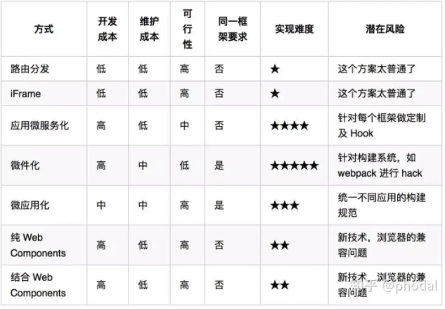

### 需求
原系统的前端架构：共涉及 adp \ dataresource \ datapublish 等，主要就是看 adp 和 dataresource 这两个部分，其他是一样的。
原系统当中 引入 dataresource 页面使用 新建一个 iframe - html 来存放 dataresource 中 不含侧边栏和头部的页面内容，
adp 中 使用 Jquery.load 函数共享 侧边栏和顶部的 代码，tab 暂时没法实现暂存功能（由于是每个页面一个 html, 所以这边如果做用户动作缓存的话会
非常麻烦）。

当前个人使用 vue-element-admin 精简版的 permission 版本，添加了 iframe ,tabs 利用 iframe 显隐来实现，
但是侧边栏部分一些直接的跳转链接 ， 特别是 本地其他系统中的 如海豚调度分析的页面，还好是部署在一个 服务器上面，
所以部署之后不存在跨域问题， iframe 使用 也不存在跨域问题，这里 Iframe 的 src 都是使用 代码进行拼接的，
所以比较不好，当然这个系统实际上也是不好满足系统需求。

现在需要考虑使用微前端的一些架构来重构和优化前端：
1、能够实现 tab 页面，可以缓存 用户的临时操作  => 跨域解决，暂时不需，因为服务器和前端部署在一个上面
2、满足 侧边栏跳转 出去的方法
3、各个系统的前端可以使用不同的技术
4、尽量不要改动太大
5、......

? 慢慢来吧，一个都不会，你让我怎么弄？？？

### 实践
single-spa: https://wenku.baidu.com/view/51645510084c2e3f5727a5e9856a561252d321f3.html?rec_flag=default&fr=Recommend_RelativeDoc-90229,100206,80166,90233,80139,80163,80259,110192,90232-search_rec_append-ce52b24224d3240c844769eae009581b6bd9bd1e&sxts=1653288514385

微前端框架整体架构思路 ： 
https://wenku.baidu.com/view/ce52b24224d3240c844769eae009581b6bd9bd1e.html

很详细解说{不过因为没有实践，没有很大感触，也不是很能理解}：
https://baijiahao.baidu.com/s?id=1686682076288080581&wfr=spider&for=pc

#### 6.1 singla-spa 
官方网址：[https://zh-hans.single-spa.js.org/docs/getting-started-overview](https://zh-hans.single-spa.js.org/docs/getting-started-overview)
https://zhuanlan.zhihu.com/p/378346507
网址：
https://zh-hans.single-spa.js.org/
https://zh-hans.single-spa.js.org/docs/getting-started-overview

#### 6.2 qiankun
官方网址：[https://qiankun.umijs.org/zh/guide](https://qiankun.umijs.org/zh/guide)
采用了 umi: [https://umijs.org/zh-CN/docs/config](https://umijs.org/zh-CN/docs/config)

#### 6.3 micro-app
官方网址：[https://cangdu.org/micro-app/docs.html#/](https://cangdu.org/micro-app/docs.html#/)

#### 6.4 mooa

#### 6 种方式 实施微前端
路由分发(如 nginx) | 前端微服务化(如 singla-spa) | 微应用() | 微件化Widget(直接嵌入) | iframe | Web Components

> 具体设计和编码的时候，可能涉及到较多前端技术，需要慢慢来。

### 文件夹说明
#### test1
https://www.bilibili.com/video/BV1AJ411n7tk?spm_id_from=333.999.0.0

#### 1
https://www.bilibili.com/video/BV1Go4y197xW?p=1&vd_source=09634d6a492791d657f7208fcb1e7062